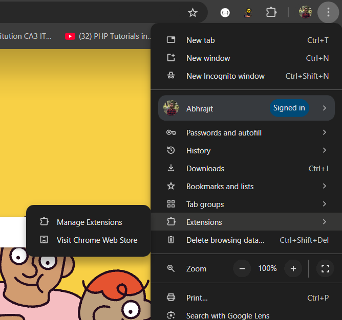
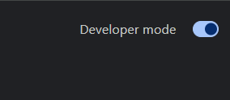
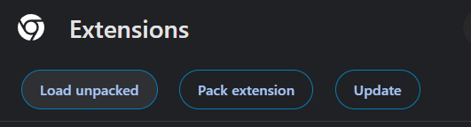
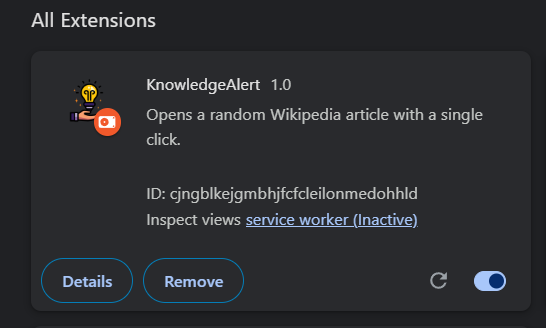
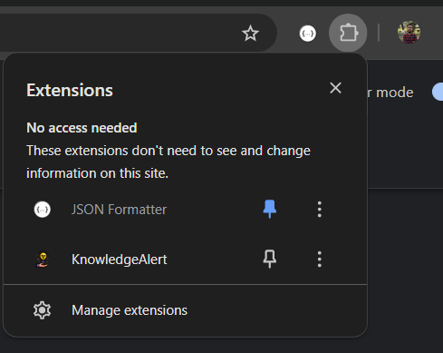

# KnowledgeAlert
I have created an extension where any user can randomly get wikipedia articles for gaining knowledge on a daily basis.

## How to use it
- Clone this repository into your system
```
git clone https://github.com/abhrajit2004/KnowledgeAlert
```
- Go to chrome Extensions ---> Manage Extensions



- Make sure the Developer mode is enabled on top right



- You have to click on **Load unpacked** on top left and select the cloned repository folder



- You can see the extension and make sure it is enabled



- Now you are ready to use this extension

